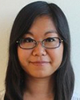
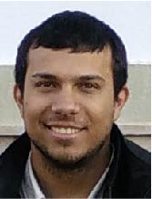
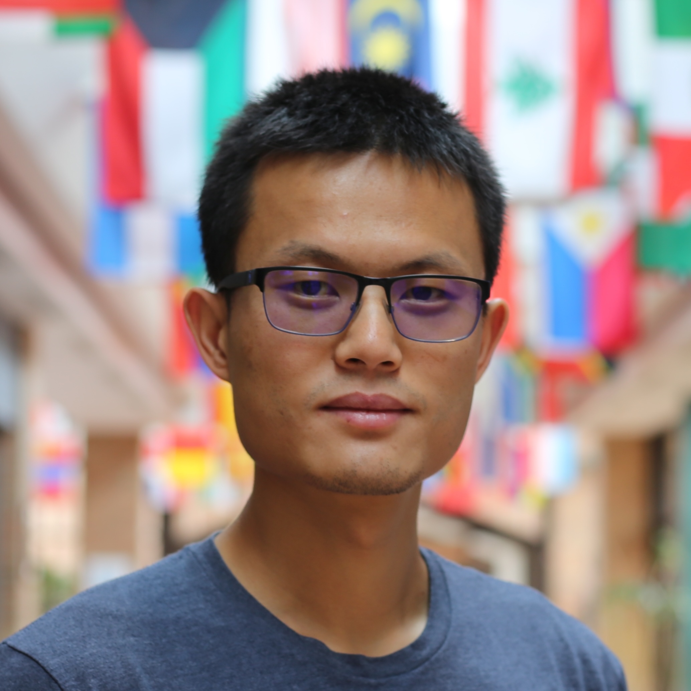
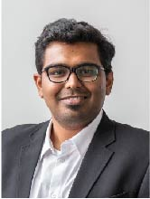
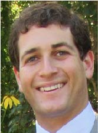

---
  hide:
    -navigation
---

# Contact

## Workshop Endorsement Request

For IROS 2023, the TC will no longer simply issue TC endorsement letters for workshops, but the endorsement will result in a more consolidated collaboration in term of sponsorships. If you are organizing a workshop at IROS 2023 and would like support from the TC, you can use this form: ([link](https://forms.gle/uq9wpFvtPT9iuEor8)).

If you are organizing a workshop and would like a letter of support from the TC, please complete the following form: ([link](https://forms.gle/c1xwLRkUN5VHVaF8A))

## Contribute to the TC

If you would like to contribute with projects, publications, tools, or any resources you think may be of interest to the community, you can use this form: ([link](https://forms.gle/XT2gzdZWCgZVtvPC9)).

## Email

[tc.opt.rob@gmail.com](mailto:tc.opt.rob@gmail.com)

## Co-Chairs

### Sylvain Calinon

{: style="width:10%"}

**Affiliation**: Idiap Research Institute, Martigny, Switzerland

**email**: [sylvain.calinon@idiap.ch](mailto:sylvain.calinon@idiap.ch)

### Adrien Escande

{: style="width:10%"}

**Affiliation**: National Institute of Advanced Industrial Science and Technology (AIST), Tsukuba, Japan

**email**: [adrien.escande@gmail.com](mailto:adrien.escande@gmail.com)

### Yue Hu

{: style="width:10%"}

**Affiliation**: University of Waterloo, Waterloo, Canada

**email**: [yue.hu@uwaterloo.ca](mailto:yue.hu@uwaterloo.ca)

### Patrick M. Wensing

{: style="width:10%"}

**Affiliation**: University of Notre Dame, South Bend (IN), USA

**email**: [pwensing@nd.edu](mailto:pwensing@nd.edu)

## Associate Co-Chairs

### Konstantinos Chatzilygeroudis

{: style="width:10%"}

**Affiliation**: University of Patras, Patras, Greece

**email**: [costashatz@upatras.gr](mailto:costashatz@upatras.gr)

### Yaran Ding

{: style="width:10%"}

**Affiliation**: Massachusetts Institute of Technology, Cambridge, MA, USA

**email**: [yanran@mit.edu](mailto:yanran@mit.edu)

### Shivesh Kumar

{: style="width:10%"}

**Affiliation**: German Research Center for Artificial Intelligence, Germany

**email**: [shivesh.kumar@dfki.de](mailto:shivesh.kumar@dfki.de)

### Brian Plancher

{: style="width:10%"}

**Affiliation**: Barnard College, Columbia University, New York City, NYC, USA

**email**: [bplancher@barnard.edu](mailto:bplancher@barnard.edu)
