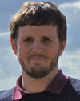
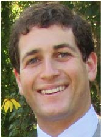

---
  hide:
    -navigation
---

# Contact

## Contribute to the TC

If you would like to contribute with projects, publications, tools, or any resources you think may be of interest to the community, you can use this form: ([link](https://forms.gle/XT2gzdZWCgZVtvPC9)).

## Email

[tc.opt.rob@gmail.com](mailto:tc.opt.rob@gmail.com)

## Co-Chairs

### Sylvain Calinon

{: style="width:10%"}

**Affiliation**: Idiap Research Institute, Martigny, Switzerland

**email**: [sylvain.calinon@idiap.ch](mailto:sylvain.calinon@idiap.ch)

### Adrien Escande

{: style="width:10%"}

**Affiliation**: Inria Center at Grenoble Alpes University, Grenoble, France

**email**: [adrien.escande@gmail.com](mailto:adrien.escande@gmail.com)

### Yue Hu

{: style="width:10%"}

**Affiliation**: University of Waterloo, Waterloo, Canada

**email**: [yue.hu@uwaterloo.ca](mailto:yue.hu@uwaterloo.ca)

### Patrick M. Wensing

{: style="width:10%"}

**Affiliation**: University of Notre Dame, South Bend (IN), USA

**email**: [pwensing@nd.edu](mailto:pwensing@nd.edu)

## Associate Co-Chairs

### Konstantinos Chatzilygeroudis

{: style="width:10%"}

**Affiliation**: University of Patras, Patras, Greece

**email**: [costashatz@upatras.gr](mailto:costashatz@upatras.gr)

### Yaran Ding

{: style="width:10%"}

**Affiliation**: University of Michigan, Department of Robotics, Ann Arbor, MI, USA

**email**: [yanrand@umich.edu](mailto:yanrand@umich.edu)

### Shivesh Kumar

{: style="width:10%"}

**Affiliation**: German Research Center for Artificial Intelligence, Germany

**email**: [shivesh.kumar@dfki.de](mailto:shivesh.kumar@dfki.de)

### Brian Plancher

{: style="width:10%"}

**Affiliation**: Barnard College, Columbia University, New York City, NYC, USA

**email**: [bplancher@barnard.edu](mailto:bplancher@barnard.edu)

### Frederike Dümbgen

{: style="width:10%"}

**Affiliation**: Willow research group, Inria Paris, France

**email**: [frederike.duembgen@gmail.com](mailto:frederike.duembgen@gmail.com)

## Student Co-Chairs

### Jasmine Terrones

{: style="width:10%"}

**Affiliation**: MIT, d’Arbeloff Robotics Lab, USA

**email**: [jterrone@mit.edu](mailto:jterrone@mit.edu)

### Ioannis Tsikelis

{: style="width:10%"}

**Affiliation**: Inria, France

**email**: [ioannis.tsikelis@inria.fr](mailto:ioannis.tsikelis@inria.fr)

### Sahánd Wagemakers

{: style="width:10%"}

**Affiliation**: Chalmers University of Technology, RAIL Lab, Sweden

**email**: [sahand.wagemakers@chalmers.se](mailto:sahand.wagemakers@chalmers.se)

### Roy Xing

{: style="width:10%"}

**Affiliation**: Dartmouth College, NH, USA

**email**: [roy.xing.gr@dartmouth.edu](mailto:roy.xing.gr@dartmouth.edu)
