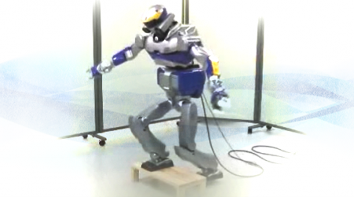

---
  hide:
    -navigation
---

# Scope

The scope of the **IEEE RAS TC on Model-based Optimization for Robotics** is the development and application of model-based optimization techniques for the generation and control of dynamic behaviors in robotics and their practical implementation.

{.carousel : style="display: block;margin-left: auto;margin-right: auto;width:50%; position: absolute"}
{.carousel : style="display: block;margin-left: auto;margin-right: auto;width:50%; position: absolute"}
{.carousel : style="display: block;margin-left: auto;margin-right: auto;width:50%; position: absolute"}
{.carousel : style="display: block;margin-left: auto;margin-right: auto;width:50%; position: absolute"}

Robots and in particular humanoid robots are extremely complicated dynamical systems for which the generation of behaviors is no easy task, since the number of parameters to tune for a behavior is very high. But the challenges waiting for today's robots require them to automatically generate and control a wide range of behaviors in order to be more flexible and adaptive to changing environments. Optimization or optimal control offers an interesting way to generate behaviors automatically based on elementary principles (cost functions, constraints). Moore's law as well as recent developments in optimization algorithms and in particular real-time optimization make a wider application of algorithmic optimization a realistic option even for real-time control in complex robotic applications in the near future.

{: style="display: block;margin-left: auto;margin-right: auto;width:30%"}

Important research areas promoted by the **TC Model-based optimization for Robotics** include:

- Optimization-based generation of robot trajectories using dynamical models of the robot and its environment
- Improve the behavior style of robots by optimization, in particular for humanoid robots (induce natural behavior)
- Online motion control using real-time model-based optimization and model predictive control/receding horizon control
- Development of appropriate dynamical models for offline and online optimization
- Learning/improving models during optimization
- Inverse optimal control techniques for the identification of objective functions
- Robust optimal control and refinement of optimal controls based on actual experience
- Combination of optimization and machine learning approaches
- Combination of optimization and path planning methods
- This interdisciplinary scope includes establishing bridges to the mathematical optimization community as well as to the field of biomechanics (to learn from biology and to identify optimality criteria) and to computer graphics (for promising optimization approaches on physically realistic models).

{: style="display: block;margin-left: auto;margin-right: auto;width:50%"}
